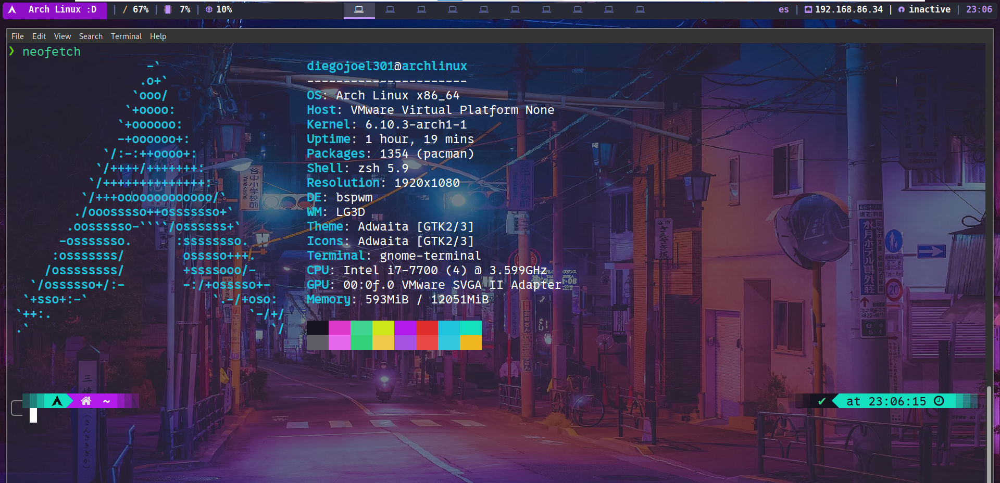

# Entorno_de_trabajo
Mi entorno netamente personalizado de bspwm, sxhkd, polybar, entre otros

## Para Gnome-Terminal

```
  dconf load /org/gnome/terminal/ < gnome-terminal-config.conf
```

Foto de mi entorno de trabajo UwU

